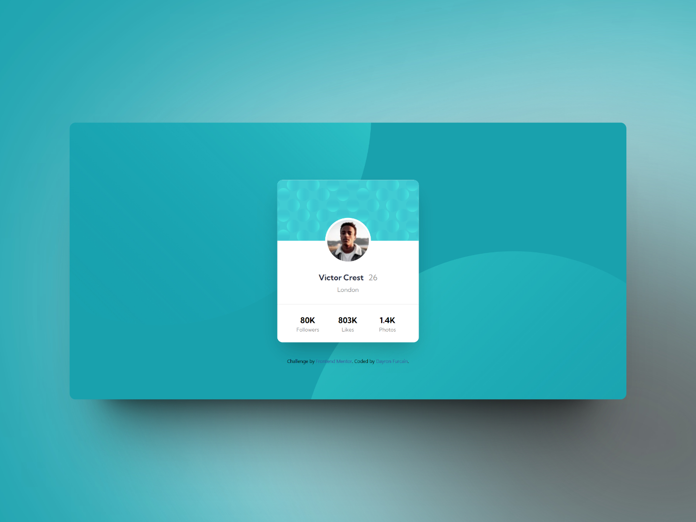

# Frontend Mentor - Profile card component solution

This is a solution to the [Profile card component challenge on Frontend Mentor](https://www.frontendmentor.io/challenges/profile-card-component-cfArpWshJ). Frontend Mentor challenges help you improve your coding skills by building realistic projects.

## Table of contents

- [Overview](#overview)
  - [The challenge](#the-challenge)
  - [Screenshot](#screenshot)
  - [Links](#links)
- [My process](#my-process)
  - [Built with](#built-with)
- [Author](#author)

## Overview

### The challenge

- Build out the project to the designs provided

### Screenshot

### Links

- Solution URL: [Profile Card](https://github.com/dayronfurcain/profile-card)
- Live Site URL: [Profile Card](https://majestic-bavarois-6b0e70.netlify.app/)

## My process

### Built with

- Semantic HTML5 markup
- Tailwind CSS

**Note: These are just examples. Delete this note and replace the list above with your own choices**

## Author

- Frontend Mentor - [@dayronfurcain](https://www.frontendmentor.io/profile/dayronfurcain)
